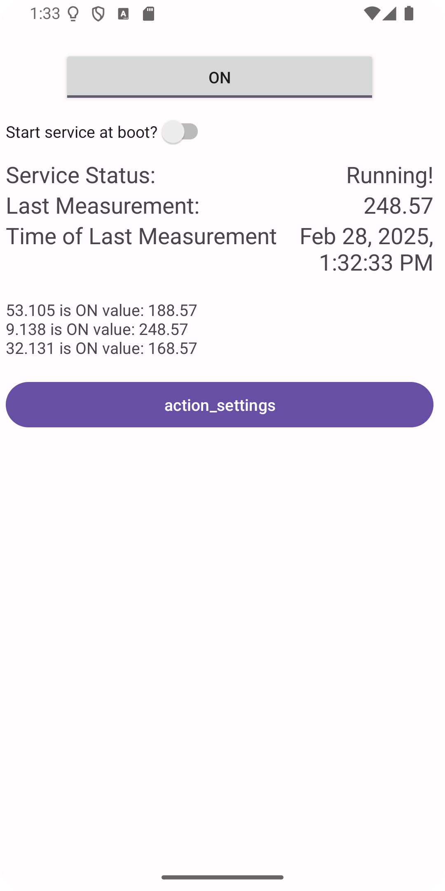

# PROJET AMIO Lucas BONANCIO SKORA Michaël YANG

Une application Android exploitant les mesures de capteurs de lumière issues d'un réseau de capteurs et exposées à travers un web service (IoTLab de TELECOM Nancy). Le but est de détecter les lumières laissées actives dans les bureaux en soirée.

## Github du projet
   ```bash
   https://github.com/LucasEBSkora/AMIO-project.git
   ```


## Objectifs et attentes

- **Surveillance en temps réel** : lister dans l'activité principale les capteurs actifs et les valeurs de luminosité qu'ils relèvent, en mettant en évidence ceux qui indiquent la présence d'une lumière active.
- **Notification** : émettre une notification si une nouvelle lumière vient d'être allumée en semaine entre 19h et 23h, en spécifiant le capteur impliqué.
- **Envoi de mail** : envoyer un email si cet événement survient le week-end entre 19h et 23h ou en semaine entre 23h et 6h.
- **Paramètres personnalisables** : Configurez les heures d'alerte et l'adresse email dans les préférences.


## Réalisation

### Page principale




Le bouton permet de lancer ou d'arrêter le service. "Start service at boot", vous pouvez choisir le lancement automatique du service au démarrage de l'application. Notez que ce choix sera conservé même après la fermeture de l'application.

Une fois le service lancé, le statut du service change en "Running !" et des mesures sont affichées. Pour chaque nouvelle prise de mesure par l'application, elle recevra les valeurs des capteurs et l'heure et la date associées.

Le réseau des capteurs qui détectent la luminosité est composé de trois capteurs 53.105, 9.138 et 32.131. "Last Measurement" correspond au maximum des valeurs des trois capteurs.

Le bouton "action_setting" ouvre le volet des paramètres de l'application.

### Surveillance en temps réel

### Notification

### Envoi de mail
À chaque nouvelle mesure récupérée, l'application va tester sa valeur et sa date. Si la valeur est supérieur à 275 et si la date est dans les heures où l'envoi de mail doit se faire (cf paramètres personnalisables) alors le service va créer un Intent du type "SEND_EMAIL".

L'objet et le corps du mail sont déjà prédéfinis respectivement par "Alerte : Valeur critique détectée" et "La mesure suivante a dépassé 275 : ... " avec son label, sa valeur et son heure. L'adresse d'envoi dépendra des paramètres personnalisables.

### Paramètres personnalisables
